# Phase 28 — Full System Design & Architecture Audit

**Date:** 2026-08-17
**Repository:** `Ziad-E-commerce` — branch `main` (HEAD `e014fb3`)
**Audit method:** source-of-truth inspection of `apps/api`, `apps/web`, `apps/api/prisma`, all 9 migrations, 137 API unit specs + 36 API e2e specs + 26 web unit tests + 5 web e2e specs, and the docs in `docs/`.
**Scope:** architecture audit and design only. **No code was changed.**

> **Final Rule honored:** correctness, tenant isolation, performance, maintainability, scalability and simplicity — not architectural complexity.

---

# 1. Executive Summary

The system is a **well-architected modular monolith** that is significantly ahead of a typical MVP: real Row-Level Security (FORCED, with a runtime enforcement role), composite-FK tenant-safe schema, three deliberately separated state machines (order / payment / shipment), atomic guarded inventory statements, provider abstractions for payments and shipping, HMAC-verified webhooks with database-level deduplication, and an unusually thorough test suite.

## What is good (DO NOT CHANGE)

- Tenant isolation is the strongest area. Every write path runs inside `TransactionService.runWithTenant`, which does `SET LOCAL ROLE ziad_runtime` + `app.set_current_store_id()`. RLS is `FORCE`d on all tenant tables, so even a table owner is subject to policies when running under the enforcement role. The tenant chain (`User → ACTIVE StoreMembership → Store`) is fail-closed and the client-supplied store id is only ever a lookup key.
- Commerce correctness: checkout creates order + reservations + cart completion in ONE transaction; inventory mutations are single-statement guarded SQL (`WHERE on_hand - reserved >= qty`), so the "Stock=1, two simultaneous buyers" race is prevented at the database level; CHECK constraints (`on_hand >= 0`, `on_hand >= reserved`, `grand_total` consistency, money ≥ 0) back everything.
- COD is correctly modeled: a COD order is created `UNPAID`, stays `UNPAID` through shipment, and only becomes `PAID` when the carrier confirms `DELIVERED`. Order status, payment status and shipment status are independent enums.
- Shipping already implements the requested provider abstraction (`ShippingProvider` interface → Bosta adapter) with a customer-safe status mapper — customers see "Order confirmed / Handed to courier / At delivery center / Out for delivery / Delivered / Rejected", never the provider brand.
- Payments already implement the provider abstraction (`PaymentProvider` → Paymob), HMAC webhook verification, `payment_events` dedup, and idempotent guarded transitions with reservation consume/release in the same transaction.

## What is risky (needs attention)

1. **Returned/rejected shipments do not restock inventory** (P1). Reservations are CONSUMED on payment/delivery; a `RETURNED`/`REJECTED`/`DELIVERY_FAILED` shipment is a terminal carrier state but nothing restores `on_hand` — merchant stock silently disappears for COD returns.
2. **RLS enforcement is staged, not complete** (P1). Only `runWithTenant` transactions are RLS-protected. Non-transactional reads on the shared client rely solely on application-level store scoping; `payment_events` inserts and store creation (owner path) are intentionally outside RLS today. Mitigated by app-level scoping + e2e cross-tenant tests, but a defense-in-depth gap for Stage 2.
3. **No payment-event retry/reconciliation job** (P1). `payment_events` has a `processing_status` partial index designed for a retry scan, but no job consumes it. Payments stuck in `PROCESSING` have no automated recovery.
4. **Observability is minimal** (P1). Health endpoints exist, but no structured logs, request IDs, correlation IDs, metrics, or error tracking. "Why did payment fail?" / "Which endpoint generates the most DB load?" cannot be answered from production today.
5. **In-memory caches and rate limiter are per-instance** (P1/P2). Correct for the current single Render instance; must become shared before scaling to ≥2 instances.
6. **Storefront is client-rendered with no caching/SSG** (P1/P2). Product/category storefront pages fetch on every load with no ISR/CDN; SEO is effectively zero. Media is proxied through the API (`Cache-Control: max-age=3600`); no CDN/thumbnails yet (correctly deferred).

## Needs attention but NOT urgent

- Order lifecycle has no `REJECTED`/`FAILED`/`RETURNED` order states (only `CANCELLED`); shipment terminal states carry the failure semantics. Acceptable today; order-level reconciliation needed before returns become common.
- COD orders create no `Payment`/`PaymentAttempt` row — accounting/reporting will need a COD collection record (P2).
- `REFUNDED`/`PARTIALLY_REFUNDED` exist on `OrderPaymentStatus` but no refund flow is implemented (P2).

**Overall:** the architecture can safely serve Stage 1 (100 stores / 1,000 products/store / 10k orders/month) today, and Stage 2 (1,000 stores / 10k products/store / 100k orders/month) with the P1 items above. It is a modular monolith and should stay one — no microservices are justified by evidence.


---

# 2. Repository Findings (source of truth)

## 2.1 Top-level
- Monorepo (npm workspaces): `apps/api` (NestJS 11), `apps/web` (Next.js 16, React 19), `docs/` (34 docs), `scripts/`.
- API `package.json`: NestJS 11 + Prisma 6 + class-validator. **No ORM cache library, no queue, no Redis, no Sentry** — all deliberately absent.
- Web `package.json`: Next 16 + React 19 + `@supabase/supabase-js`. No state-management library (plain React context + hooks).

## 2.2 API structure — modules with clean layering
`auth`, `authorization`, `cart`, `catalog`, `checkout`, `cms`, `common`, `config`, `customer`, `dashboard`, `health`, `identity`, `infrastructure`, `inventory`, `jobs`, `media`, `orders`, `payments`, `prisma`, `rate-limit`, `shipping`, `store-settings`, `storefront`, `storefront-commerce`, `subscription`, `tenant`, `whatsapp`.

Commerce modules follow a consistent `controller / dto / domain / repositories / services` layout. Repositories are thin Prisma wrappers (store-scoped); services hold business rules; domain folders hold pure state machines (e.g. `order-lifecycle.ts`, `payment-lifecycle.ts`, `shipment-status.ts`, `reservation-lifecycle.ts`).

## 2.3 Database — 31 tables total
`users, stores, store_memberships, subscriptions, products, product_variants, categories, product_categories, inventory, inventory_reservations, inventory_movements, customers, customer_addresses, carts, cart_items, orders, order_items, payments, payment_attempts, payment_events, pages, page_sections, navigations, theme_configurations, media, product_media, store_settings, audit_logs, shipments, shipment_status_history, job_leases`.

## 2.4 Migrations (9, forward-only)
1. `20260812000000_init` — full schema, CHECK constraints, partial uniques, `app` schema + `current_store_id()`/`set_current_store_id()`, RLS ENABLE + full `tenant_isolation`/`public_storefront` policy set.
2. `20260814000000_rls_enforcement` — `ziad_runtime` NOLOGIN role (member of `authenticated`), DML grants, `FORCE ROW LEVEL SECURITY` on all tenant tables.
3. `20260815000000_whatsapp_orders` — `orders.channel` enum.
4. `20260816000000_order_lookup_token_and_job_leases` — `orders.lookup_token` + `job_leases`.
5. `20260817000000_rls_policy_fixes` — fixed self-referential membership policy; granted `set_current_store_id` to `anon`.
6. `20260818000000_rls_app_tenant_policies` — app-tenant SELECT/UPDATE policies for `stores`/`store_memberships`/`subscriptions`.
7. `20260819000000_performance_indexes` — `(store_id, created_at DESC)` composites + `(store_id, status, created_at DESC)` for orders + pg_trgm GIN indexes.
8. `20260820000000_catalog_gallery_variants` — `variants.attributes` JSONB, `product_media.is_primary`, multilingual labels, cover-image index.
9. `20260821000000_shipping_cod` — payment method/status enums + `shipments`/`shipment_status_history` + RLS policies + DML grants.

## 2.5 Tests
- API: 137 unit specs (state machines, error mappers, DTOs, security headers, tenant binder, transaction service).
- API e2e: 36 suites including per-domain e2e, `*.blocked.e2e-spec.ts` database tests (gated on `TEST_DATABASE_URL`), `rls-integration.e2e-spec.ts` (real-Postgres cross-tenant RLS probe), `system-integration.e2e-spec.ts` (endpoint inventory, subscription overlay, error envelope).
- Web: 26 unit tests (Vitest) + 5 Playwright e2e suites.

---

# 3. Current Architecture (verified)

## 3.1 Deployment
- **Web** — Vercel (Next.js). `next.config.ts` fails production builds when `NEXT_PUBLIC_*` vars are missing/malformed (verified live). `proxy.ts` rewrites `{slug}.{STOREFRONT_DOMAIN}` → `/store/{slug}` (routing only; tenant resolution stays server-side on the API). Security headers globally; HSTS opt-in.
- **API** — Render (NestJS, `0.0.0.0:4000`). `POST /api/v1/webhooks/paymob` and `/webhooks/bosta` are public with HMAC verification. Health: `/health`, `/health/live`, `/health/ready`. CORS allowlist (`CORS_ORIGINS`, wildcard forbidden in production). `TRUST_PROXY` for real client IPs.
- **Database/Auth/Storage** — Supabase. `DATABASE_URL` via transaction pooler (6543), `DIRECT_URL` (5432) for migrations. RLS enforcement role `ziad_runtime`.

## 3.2 Authentication
Browser ↔ Supabase Auth (email/password + PKCE, `detectSessionInUrl`). API validates `Authorization: Bearer` via `SupabaseAuthProvider.verifyToken` → `GET {SUPABASE_URL}/auth/v1/user` (server-side, fail-closed). Verified identities are memoized in a bounded 60s TTL in-memory cache (only successful verifications; revoked-token window ≤60s, documented). The web API client auto-refreshes the Supabase session once on 401.

## 3.3 Tenant resolution (per request)
```
AuthGuard → TenantContextGuard → RolesGuard → SubscriptionAccessGuard
```
`TenantContextGuard` resolves `user.authUserId + (x-store-id | :storeId as LOOKUP key)` → ACTIVE membership → Store. Fail-closed: no membership → 403; multiple stores without a selector → requires selection. Cached 60s in-memory (5,000 cap), invalidated on store update. Storefront resolves the store from `X-Storefront-Slug` header or Host subdomain — never client input — with a 60s bounded cache (2,000 cap); subscription status overlaid (EXPIRED ⇒ storefront 404, read-only dashboard).

## 3.4 RLS model
- Session GUC `app.current_store_id()` is the policy key. `tenant_isolation_*` (authenticated) + `public_storefront_select` (anon, ACTIVE-only) + `app_tenant_*` policies for the four special tables.
- `runWithTenant` = interactive Prisma transaction + `SET LOCAL ROLE <RLS_ENFORCEMENT_ROLE>` + `app.set_current_store_id(storeId)` + guaranteed reset in `finally`. Provider calls stay outside transactions (documented §28.7).
- Join-based policies for child tables without a `store_id` column (`cart_items`, `order_items`, `payment_attempts`, `page_sections`).
- The **shared client** (non-transactional reads, store creation, webhook event inserts) currently runs outside the enforcement role — see Finding F-2.


## 3.5 Catalog
`Store 1:N Category 1:N Product 1:N Variant 1:1 Inventory`, `Product N:M Category` (`product_categories`), `Product N:M Media` (`product_media` with `sort_order`, `is_primary`, `variant_id`). Product lifecycle `DRAFT → ACTIVE/ARCHIVED`. Variants carry JSONB `attributes` (`{color, size}`) and are the inventory/pricing boundary. Galleries are paginated (merchant detail = 24 images; storefront detail = 12; lists = 1 cover). Media binary lives in a private Supabase bucket; the API streams it via `GET /storefront/media/:id/content` with `Cache-Control: public, max-age=3600`.

## 3.6 Cart → Checkout → Order
- Guest cart (256-bit opaque token in localStorage per store slug). One line per variant (`UNIQUE(cart_id, variant_id)`); availability checked but NOT reserved at add time; cart pricing is display-only.
- Checkout (`POST /checkout` or `/storefront/checkout`): one tenant-bound transaction — store status → cart usable → revalidate variant/product/price/quantity → resolve/create customer → **atomic guarded reservations** → create PENDING order + snapshot order items + order number → link reservations → complete cart. Any failure rolls back everything. Idempotent via `Idempotency-Key` (partial unique `(store_id, idempotency_key)`), retried up to 5× on order-number collisions.
- `lookupToken` (192-bit) gates PII on the public order confirmation endpoint; stored in `sessionStorage`, never in URLs.

## 3.7 State machines (three, separate)
- **Order:** `PENDING → CONFIRMED → PROCESSING → SHIPPED → DELIVERED`; `PENDING/CONFIRMED → CANCELLED` (guarded conditional UPDATE, audit-logged, releases reservations on cancel; WhatsApp orders consume reservations on CONFIRMED).
- **Payment (per Payment row):** `PENDING → PROCESSING → SUCCEEDED | FAILED`. Only a PENDING order is payable; a non-FAILED payment blocks new initiation.
- **Order payment status:** `PAID | UNPAID | FAILED | REFUNDED` — COD stays UNPAID until carrier confirms DELIVERED, then UNPAID→PAID in the same transaction as the shipment transition.
- **Shipment:** `CREATED → HANDED_TO_COURIER → AT_DELIVERY_CENTER → OUT_FOR_DELIVERY → DELIVERED`, failure paths `REJECTED | DELIVERY_FAILED → RETURNED | CANCELLED`, append-only `shipment_status_history` (dedup `UNIQUE(shipment_id, provider_event_id)`).

## 3.8 Payments (online)
`PaymentProvider.initiatePayment` (Paymob Intention) is called OUTSIDE the transaction; PENDING Payment + Attempt created inside. Webhook: HMAC verify → claim `payment_events` (`UNIQUE(provider, provider_event_id)`) → resolve payment → one tenant-bound transaction applies guarded SUCCEEDED (consume reservations, order PENDING→CONFIRMED) or FAILED (release reservations). Browser redirect is never authoritative.

## 3.9 Shipping (Phase 27)
`ShippingProvider` interface → Bosta adapter (`createShipment/getShipment/cancelShipment/getShippingLabel/verifyWebhookSignature/parseWebhookEvent`). Merchant creates a shipment for CONFIRMED/PROCESSING/SHIPPED orders (idempotent via `UNIQUE(store_id, order_id)`); provider calls outside transactions. Bosta webhook: HMAC over raw body → resolve shipment by provider id → tenant derived from the shipment's own store → mapped internal status + history + side effects (COD payment UNPAID→PAID on DELIVERED; order SHIPPED→DELIVERED). Customer tracking endpoint returns a provider-brand-free timeline.

## 3.10 Performance (Phase 25 baseline, all verified present)
Bounded in-memory TTL caches (auth verify 60s/1k, tenant 60s/5k, storefront 60s/2k; disabled under `NODE_ENV=test`), aggregated dashboard endpoint (parallel store-scoped aggregates + `SUM(grand_total)`), grouped inventory endpoint, paginated media, lean list projections, `(store_id, created_at DESC)` + `(store_id, status, created_at DESC)` + pg_trgm GIN indexes. Measured before/after in `docs/PHASE25-PERFORMANCE-FINAL.md` (auth latency 1.2–3.0s → sub-second warm).

## 3.11 Background jobs
One job: cart/reservation expiry sweep, env-gated, interval-based with a PostgreSQL `job_leases` distributed lease (multi-instance safe). `payment_events` retry scan is designed (partial index) but **not implemented** (Finding F-3).


---

# 4. Frontend Architecture (apps/web — verified)

## 4.1 Structure
- **Routes:** `(marketing)` landing/demo/terms/privacy, `login`, `signup`, `onboarding`, `dashboard/*` (products, categories, customers, orders, media, settings, store), `store/[slug]/*` (home, products, categories, product detail, cart, checkout, orders, tracking, pages).
- **Auth:** `lib/auth` — `use-supabase-session`, `auth-context` (React context resolving `/auth/me`), `merchant-route` (single source for dashboard-vs-onboarding redirect). Route protection is **client-side only** (DashboardGate) — the API is the real authorization boundary.
- **API client:** `lib/api/client.ts` — one typed client: reads the current Supabase access token per request, retries once after a 401 with a session refresh, parses the `{ error: { code, message } }` envelope into `ApiError`. Per-domain modules (`catalog`, `orders`, `cart`, `media`, `inventory`, `storefront`, `payments`, `subscription`, `dashboard`, `customers`, `store`, `theme`, `onboarding`) return typed payloads. `apiUpload` handles raw-binary media uploads.
- **State:** React context + hooks only — `auth-context`, `storefront-context` (store/theme/navigation/cart), `i18n-context`. No Redux/Zustand/React Query — correct at this size.
- **i18n:** `lib/i18n` — `en`/`ar`, `localeDirection()` for RTL/LTR applied to `<html dir>` pre-hydration (no flash). Merchant + storefront translation dictionaries.
- **Guest cart:** `lib/storefront/guest-cart.ts` (localStorage per store slug), `order-token.ts` (sessionStorage lookup tokens).
- **Media:** gallery upload queue `product-gallery-queue.ts` (client-side serialized queue with tests); storefront renders images through the blob proxy URL.

## 4.2 Patterns observed
- Client components with `useCallback`/`useEffect` fetch-in-effect (page-level `load()`), debounced search (400ms), skeleton/empty/error states, `Pagination`/`FilterBar`/`StatusBadge`/`Modal`/`Toast`/`FormControls` shared UI kit.
- Storefront `storefront.css` has 7 `@media` breakpoints (responsive verified Phase 27); theme colors applied as CSS variables from the API theme.

## 4.3 Strengths
Consistent error handling (localized `apiErrorMessage`), no duplicate business logic in the frontend (server revalidates everything), reusable UI components, RTL/LTR first-class, responsive.

## 4.4 Gaps
- **All storefront pages are `'use client'` + fetch-in-effect** → no SSG/ISR, no SEO meta from the server, every page load hits the API (plus the storefront resolution cache). This is the main web-side performance/SEO weakness (Finding F-6).
- No route-level middleware for the merchant dashboard (client gate only — acceptable because the API is authoritative, but dashboard HTML is not protected server-side).
- No client caching layer (React Query/SWR); acceptable today, revisit when storefront traffic grows.
- Duplicated page-level fetch boilerplate (each page re-implements load/error/loading) — a small `useApiQuery` hook would DRY it (P2).

---

# 5. Database Architecture (actual, from schema.prisma + migrations)

## 5.1 Design strengths (verified)
- **Money = BIGINT minor units** (EGP piastres) with `CHECK (amount > 0)`, `grand_total` consistency CHECK. No floats anywhere.
- **Tenant-safe composite FKs:** parent tables (`products`, `product_variants`, `categories`, `customers`, `orders`, `pages`, `media`) carry `@@unique([storeId, id])`; children reference `(store_id, parent_id)` → `(store_id, id)`. Child writes physically cannot cross tenants.
- **CHECK constraints:** inventory (`on_hand >= 0`, `reserved >= 0`, `on_hand >= reserved`), reservations (`quantity > 0`, cart OR order context), order totals, media size, shipment COD/shipping cost.
- **Partial unique indexes:** single OWNER per store, guest cart token per store, `(store_id, idempotency_key)` on orders/payments/attempts, `(provider, provider_reference)` on payments, `(provider, provider_event_id)` on payment_events, `(shipment_id, provider_event_id)` on status history, `idx_payment_events_processing_status` retry scan.
- **Purchase-time snapshots:** `order_items` carry name/SKU/price snapshots; orders carry `shipping_address_snapshot`. Current rows never substitute history.
- **Immutable append-only tables:** `inventory_movements`, `payment_events`, `shipment_status_history`, `audit_logs`.

## 5.2 ERD (Mermaid)

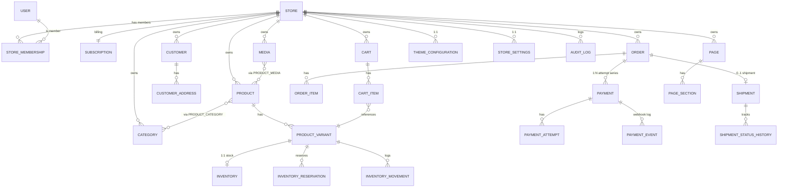

## 5.3 Missing/recommended database entities
- **`OrderStatusHistory`** (P2) — order status changes are audit-logged but not time-series; a dedicated history table (like shipments) would power merchant timelines and analytics.
- **COD payment record** (P2) — COD orders have no `Payment` row; recommend creating a Payment record at delivery-collection time for accounting.
- **`Refund`** entity (P2) — `REFUNDED`/`PARTIALLY_REFUNDED` exist on the enum but no refund rows/flow exist.

---

# 6. API Module Map (actual)

```text
API (NestJS, /api/v1)
├── Health            /health, /live, /ready
├── Auth              /auth (Supabase token verification + memoization)
├── Identity          /stores, /onboarding  (store+OWNER membership+trial creation)
├── Catalog           /products, /categories, /variants, /products/:id/media, /products/:id/inventory
├── Inventory         (service layer: reservation/consume/release; no controllers)
├── Customers         /customers, /customers/:id/addresses
├── Cart              /cart (guest; merchant surface)
├── Checkout          /checkout (order creation transaction; no persistent entity)
├── Orders            /orders (list/get/status transition/cancel; audit; reservations)
├── Payments          /orders/:id/payments, /orders/:id/payment, /webhooks/paymob
├── Shipping          /orders/:id/shipment, tracking refresh, /webhooks/bosta
├── Storefront        /storefront (read-only public: store/products/categories/pages/media)
├── StorefrontCommerce /storefront/cart|checkout|orders|whatsapp|media/content (public guest commerce)
├── CMS               /cms pages/sections/navigation/theme
├── Media             /media (upload/list/get/delete)
├── Dashboard         /dashboard/stats (aggregated)
├── StoreSettings     /store-settings (WhatsApp config)
├── Whatsapp          /storefront/orders/whatsapp
├── Subscription      /subscription (TRIAL/ACTIVE/EXPIRED overlay guard)
└── Jobs              (reservation/cart expiry sweep, job_leases)
```

**Assessment:** module boundaries are clean; duplication is low (cart/checkout/orders/payments/shipping share repositories and the TransactionService); no circular imports observed; controllers are thin; services hold rules; repositories are thin Prisma wrappers. **Keep this shape.**


---

# 7. Security Architecture Assessment

## 7.1 What is solid (verified)
- **Authentication:** server-side Supabase token verification, fail-closed; identity never taken from body/query/params.
- **Authorization chain:** `Auth → TenantContext → Roles → Subscription` guards in a fixed order; role from DB membership, never client input.
- **Tenant isolation:** composite-FK schema + store-scoped repositories + RLS (FORCED under enforcement role) + e2e cross-tenant tests.
- **Webhooks:** Paymob HMAC and Bosta HMAC-over-raw-body (verified with `rawBody: true`); forged webhooks fail closed; database-level dedup on provider event ids.
- **Media:** server-side MIME allowlist + magic-byte sniffing + size cap; private bucket; service-role key server-only; storefront media proxied store-scoped.
- **CORS:** explicit allowlist; wildcard refused at boot in production.
- **Rate limiting:** per-IP, per-path-bucket limits incl. auth/checkout/payment; `Retry-After`; brute-force protection on auth endpoints.
- **Secrets:** env-only; service-role key never in the browser; no secrets in logs (tokens redacted).
- **CSRF:** not applicable — bearer tokens in headers, no cookies.
- **Audit:** `audit_logs` written for order status changes/payments; append-only.
- **Error envelope:** consistent, no stack traces, no Prisma internals leaked (error mappers + AllExceptionsFilter).

## 7.2 Cross-tenant attack-path analysis (explicit)
| Attack | Defense | Verdict |
|---|---|---|
| Read another store's product/order via guessed UUID | Store-scoped `findUnique(storeId_id)` + RLS `store_id = app.current_store_id()` | Blocked |
| Write another store's order/product by id | Composite-FK target `(store_id, id)` + tenant-bound transaction | Blocked |
| `x-store-id` pointing at another store | Only a membership lookup key; no matching membership ⇒ 403 | Blocked |
| Storefront: send another store's id | Storefront never accepts a client store id; slug/Host resolution only | Blocked |
| Forge a Paymob/Bosta webhook | HMAC verification fails closed; event dedup | Blocked |
| Upload an executable as an image | MIME allowlist + magic-byte match | Blocked |
| Path traversal in storage key | Server-generated keys `storeId/mediaId`; segments URL-encoded | Blocked |
| Abandoned-cart reservation exhaustion | Reservation TTL + lease-coordinated expiry sweep | Blocked |
| Double checkout / double payment | Idempotency keys (DB partial uniques) + guarded transitions | Blocked |

## 7.3 Gaps
- **F-2** RLS not active on shared-client (non-transaction) reads in the current deployment (P1).
- **F-5** In-memory rate limiter is per-instance (P1 when scaling).
- **F-7** Auth-verify cache accepts a revoked token ≤60s (documented trade-off; P2 to add a revoke signal).
- **F-8** Audit logging is not universal (product/media/settings writes are unlogged) (P2).
- **F-9** No Origin-header check on state-changing requests (minor hardening, P2).

---

# 8. Performance & Caching Assessment (Phase 25 baseline re-verified)

## 8.1 Verdicts per optimization
| Optimization | Status | Verdict |
|---|---|---|
| Auth verification memoization (60s TTL, 1k cap, successes only) | Present, correct | **KEEP** (single instance); shared cache for ≥2 instances (P2) |
| Tenant-resolution memoization (60s, 5k cap, invalidation on store update) | Present, correct | **KEEP** |
| Storefront resolution memoization (60s, 2k cap) | Present | **KEEP** — add invalidation on store/subscription change (P2) |
| Dashboard aggregation endpoint | Present, one request | **KEEP** |
| Grouped inventory endpoint | Present | **KEEP** |
| Media pagination + lean lists + bounded galleries | Present | **KEEP** |
| `(store_id, created_at DESC)` / status composites / pg_trgm GIN | Present | **KEEP** |
| Storefront product/category page caching (ISR/CDN) | **Absent** | **IMPROVE** (F-6, P1) |
| Media CDN / transformations / thumbnails | Absent (proxy + `max-age=3600`) | **DEFER** (P2, correct call today) |
| Payment-event retry/reconciliation job | Absent (index exists) | **ADD** (F-3, P1) |
| Shared (Redis) rate limiter | Absent (in-memory) | **DEFER** until ≥2 API instances (P2) |

## 8.2 Remaining N+1 / payload checks
- Product/category/order lists are lean (variants + 1 cover image); storefront list uses ACTIVE variants + inventory + 1 cover in one Prisma query. No N+1 found in list paths.
- Cart view = 2 queries (cart + items). Checkout = single transaction. Dashboard = 6 parallel aggregates. Clean.


---

# 9. Critical Findings

## F-1 — Returned/rejected shipments do not restock inventory  [P1]
**Where:** `shipping/services/shipments.service.ts` (`applyDeliverySideEffects`), `shipment-status.ts`.
**Evidence:** reservations are CONSUMED when the order is paid/delivered (`guardedConsume` decrements `on_hand`). Shipment states `REJECTED`, `DELIVERY_FAILED`, `RETURNED` are terminal for the carrier but no path restores stock.
**Impact:** for COD returns, merchant inventory silently shrinks; for prepaid returns stock is lost entirely. Data-integrity/merchant-trust issue.
**Fix (when approved):** on shipment `RETURNED` (and, per business rule, `REJECTED`/`DELIVERY_FAILED`), run a tenant-bound transaction that adds a return inventory movement (new `RETURN` `MovementType` or `ADJUSTMENT`), increments `on_hand`, and for prepaid orders transitions `payment_status` to `REFUNDED` (COD stays `UNPAID`). Guarded/idempotent.

## F-2 — RLS enforcement is staged, not complete on the shared client  [P1]
**Where:** `rls-tenant-binder.ts`, `transaction.service.ts`, migrations 20260814/18; runbook §4.
**Evidence:** only `runWithTenant` binds the enforcement role + tenant GUC. Repository reads on the shared client run outside RLS in the current deployment (documented as staged). Store creation and unresolved `payment_events` inserts rely on the owner path.
**Impact:** application-level store scoping is the only defense for those reads. Consistently applied and e2e-tested — but a single missed `storeId` filter becomes a cross-tenant leak with no DB backstop.
**Fix (when approved):** (a) Prisma middleware/query-extension forcing every non-transaction query through a tenant-bound context, or (b) full enforcement by binding the tenant on connection checkout for shared-client reads + adding the missing INSERT policies (`stores`, `subscriptions`, `store_memberships`, and `payment_events` webhook rule where `store_id IS NULL`). Do this before Stage 2.

## F-3 — No payment-event retry / payment reconciliation job  [P1]
**Where:** `payments` module, `jobs` module, `idx_payment_events_processing_status` partial index.
**Evidence:** `payment_events` rows can remain `RECEIVED`/`ERROR`; `payments.status` can remain `PROCESSING` if the webhook is lost or never fires. The retry-scan index exists; no job consumes it.
**Impact:** a customer can pay but the order stays PENDING/unconfirmed (stock reserved, released after TTL); the merchant must chase it manually. No automated recovery.
**Fix (when approved):** a lease-coordinated job (mirroring `reservation-expiry.job`) that reprocesses `RECEIVED`/`ERROR` events and optionally reconciles `PROCESSING` payments against the provider past a threshold; keep all transitions guarded/idempotent.

## F-4 — Observability is minimal  [P1]
**Where:** whole API; only `Logger` console output + health endpoints.
**Evidence:** no structured logs, request ids, correlation ids, metrics, error tracking, or tracing.
**Fix (when approved):** request-id middleware + structured JSON logging with webhook→payment→order correlation; latency/DB metrics; an error-tracking service (e.g. Sentry) for production exceptions. Justified at Stage 2.

## F-5 — Per-instance in-memory caches and rate limiter  [P1/P2]
**Where:** `rate-limit.service`, `supabase-auth-provider`, `tenant-context.service`, `storefront-store-resolver`.
**Evidence:** all in-process Maps. Correct today (single Render instance, lease-coordinated sweep). Two instances split rate-limit budgets and duplicate caches (correctness unaffected — caches are TTL-only — but limits weaken).
**Fix (when approved):** behind the existing interfaces, back rate limiting (and optionally the auth/tenant caches) with Redis (Upstash) when the second instance is added (P2), not before.

## F-6 — Storefront not server-rendered/cached; no SEO  [P1]
**Where:** all `store/[slug]/*` pages are `'use client'`.
**Evidence:** product/category/home pages fetch in the browser on every visit; no per-product metadata; no ISR.
**Impact:** storefronts are the merchant's public store — poor crawlability and slower first paint at scale.
**Fix (when approved):** convert product/category/home pages to RSC/ISR with per-slug revalidation, or put a CDN edge cache keyed by slug+locale in front of the storefront; keep cart/checkout client-side.

## F-7 — Auth cache revoked-token window (≤60s)  [P2]
Documented trade-off. Add a deny-list or reduce TTL if instant revocation is ever required.

## F-8 — Audit coverage not universal  [P2]
Product/media/settings writes are not audit-logged. Add entity-level audit for destructive/merchant-visible actions when the audit table matures.

## F-9 — COD has no Payment record  [P2]
COD orders transition `UNPAID→PAID` on delivery but create no `Payment` row; dashboards cannot show a full payment ledger for COD. Create a Payment record at collection time when accounting/reporting is needed.

## F-10 — Order lifecycle has no REJECTED/FAILED/RETURNED order states  [P2]
Order status remains `SHIPPED`/`PROCESSING` while the shipment is `RETURNED`. Deliberate separation, but merchants see an order that never reaches a final "failed" state. Decide (with F-1) whether orders mirror shipment terminal states or gain a `RETURNED` order status.


---

# 10. Architecture Score (0–10, evidence-based)

| Dimension | Score | Evidence |
|---|---|---|
| Security | 8.0 | RLS FORCE + enforcement role, HMAC webhooks, MIME/magic-byte validation, CORS allowlist, rate limiting. −2: shared-client reads outside RLS (F-2); per-instance rate limiter (F-5). |
| Scalability | 6.5 | Correct modular monolith, indexes, pagination. −3.5: in-memory caches/limiter, no queue, single region, Render cold starts. Stage 1–2 capable. |
| Performance | 7.0 | Measured before/after (Phase 25), caches + indexes + lean lists + aggregation. −3: storefront uncached (F-6), media proxied. |
| Reliability | 6.5 | Idempotent webhooks, guarded transitions, distributed lease, health checks. −3.5: no payment retry/reconciliation (F-3), no monitoring/error tracking (F-4), returns don't restock (F-1). |
| Maintainability | 8.5 | Clean module/domain/repository layering, pure state machines, 163 unit+36 e2e+31 web tests, 34 docs. |
| Multi-tenancy | 9.0 | Composite-FK schema, membership-chain resolution, store-scoped repos, RLS, cross-tenant e2e. −1: staged RLS coverage (F-2). |
| Data integrity | 8.0 | BIGINT money, CHECK constraints, atomic guarded inventory, snapshots, three separate state machines. −2: returns don't restock (F-1); COD has no payment record (F-9). |
| UX architecture | 7.5 | en/ar RTL/LTR, responsive (7 breakpoints), shared UI kit, skeleton/empty/error states. −2.5: client-only storefront (SEO/first-paint, F-6). |
| Observability | 3.5 | Health endpoints only. No structured logs/request IDs/metrics/tracing/error tracking (F-4). |

**Weighted verdict:** strong security + tenancy + maintainability; the biggest deltas are reliability/observability (P1 jobs/logging) and storefront rendering (P1 ISR/CDN).

---

# 11. Target Architecture

**Stay a modular monolith.** Rationale (evidence): current load is a single-instance NestJS app serving a confirmed pilot; no measured bottleneck requires service separation; the existing module boundaries already isolate domains (shipping/payments behind interfaces). Splitting now would add distributed-transaction and network-failure complexity for zero business benefit.

## 11.1 Target stack (unchanged core + justified additions)
- **Core (unchanged):** Next.js + NestJS modular monolith + PostgreSQL/Supabase + Prisma + Supabase Auth/Storage + Vercel/Render + RLS.
- **P1 additions (before Stage 2):**
  1. Return/restock + order-finality reconciliation (F-1/F-10).
  2. Complete RLS enforcement on the shared client (F-2).
  3. Payment-event retry + payment reconciliation job (F-3).
  4. Observability: request IDs, structured logs, metrics, error tracking (F-4).
  5. Storefront ISR/CDN caching (F-6).
- **P2 additions (Stage 2):** Redis-backed rate limiting + shared caches (F-5), media CDN/thumbnails, COD payment ledger (F-9), universal audit logging (F-8), order status history table.
- **Deliberately deferred:** queue (RabbitMQ/Redis Streams) until a measured async need exists; image-processing infra until galleries/bandwidth demand it; microservices — not justified.

## 11.2 Current architecture (Mermaid)

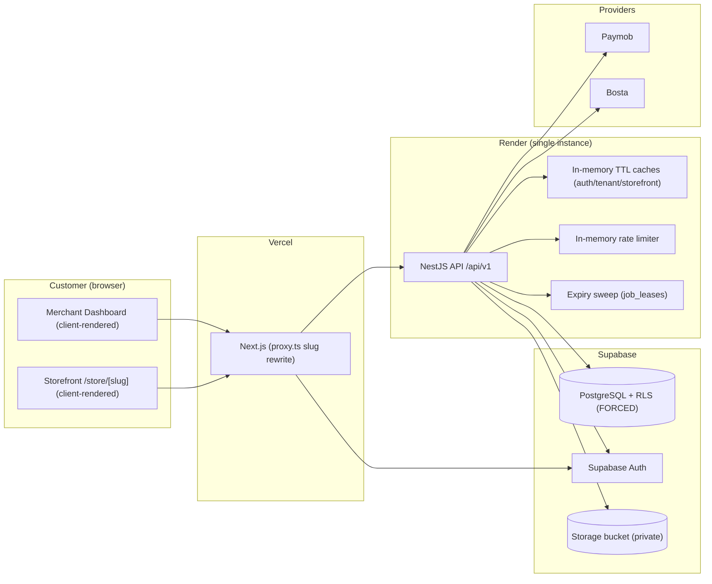

## 11.3 Target architecture (Mermaid)

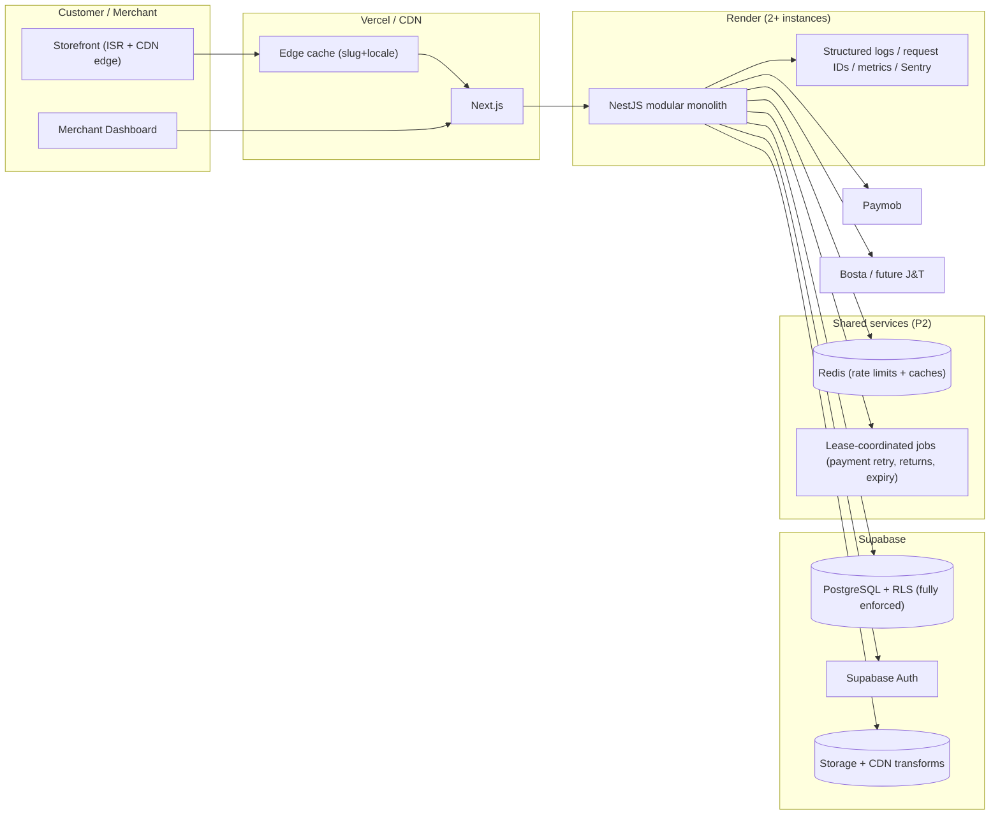


# 12. Flow Diagrams (accurate to the repository)

## 12.1 Authentication flow
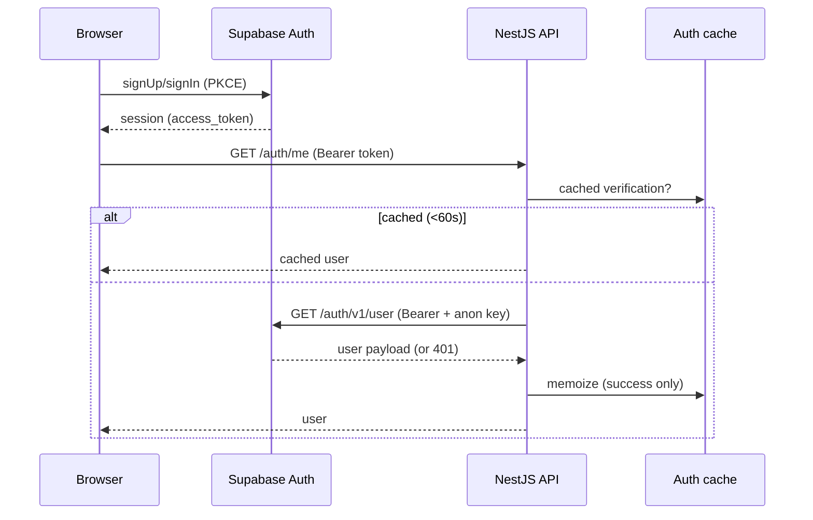

## 12.2 Tenant-resolution flow
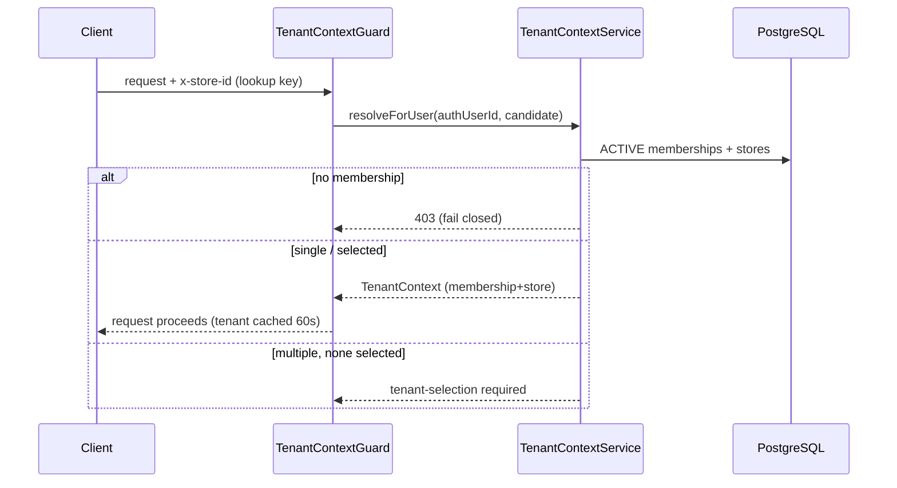

## 12.3 Product/catalog flow
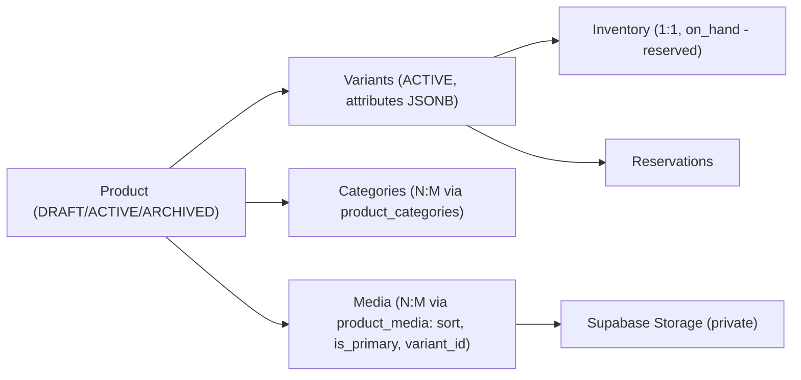

## 12.4 Cart → Checkout → Order flow
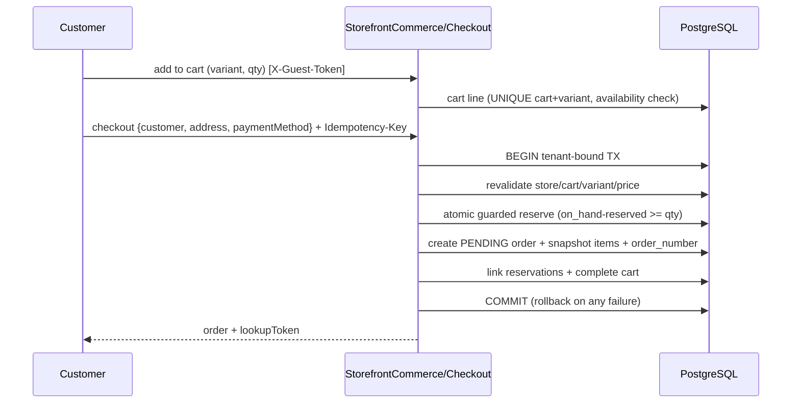

## 12.5 Payment flow (online, Paymob)
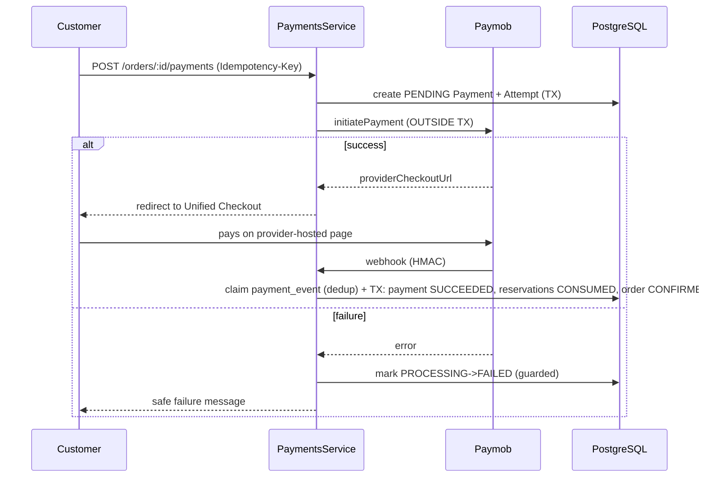

## 12.6 COD flow
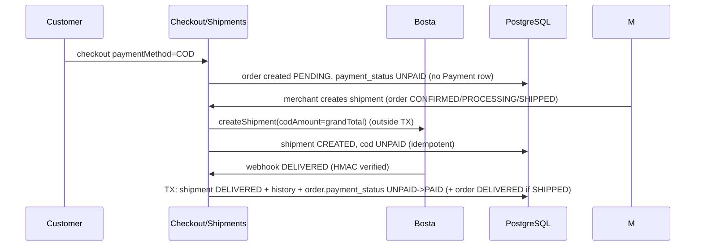

## 12.7 Shipping / tracking flow
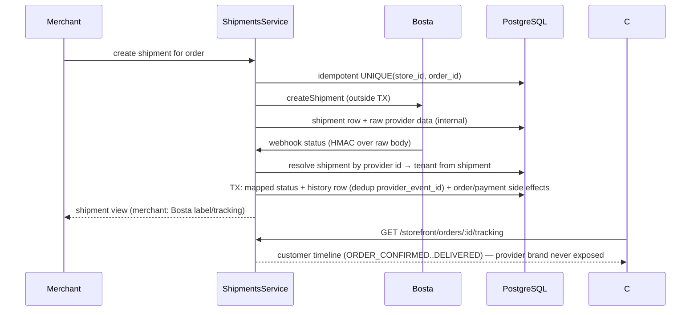

## 12.8 Media upload/delivery flow
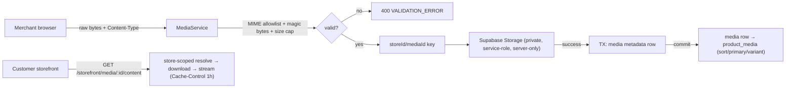

## 12.9 Cache flow
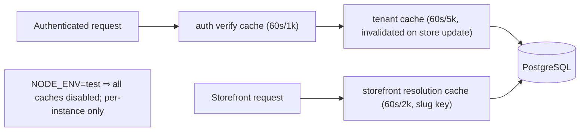

## 12.10 Event/background-job flow (current and recommended)
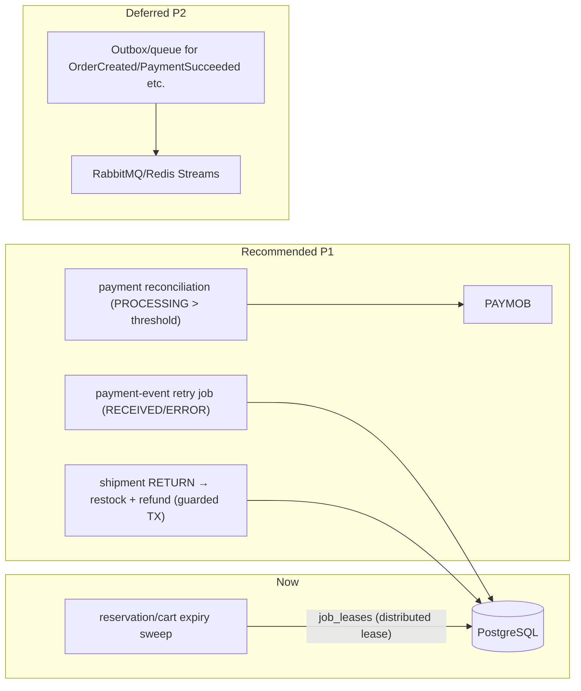

## 12.11 Deployment/infrastructure flow
```mermaid
flowchart TB
    INT["Internet"] --> DNS["DNS / CDN"]
    DNS --> V["Vercel: Next.js web + proxy.ts slug rewrite + security headers"]
    DNS --> R["Render: NestJS API (health /live /ready)"]
    V -->|HTTPS /api/v1| R
    R -->|DATABASE_URL (transaction pooler 6543)| PG[("Supabase PostgreSQL")]
    R -->|DIRECT_URL (5432)| MIG["prisma migrate deploy"]
    R -->|service-role| ST[("Supabase Storage")]
    V -->|anon key| SA["Supabase Auth"]
    R -->|HMAC| PM["Paymob webhook"]
    R -->|HMAC| BS["Bosta webhook"]
    R -->|health| CHK["Render/orchestrator probes"]
```


---

# 13. Keep / Improve / Replace / Defer

| Area | Verdict | Note |
|---|---|---|
| Modular monolith (NestJS layering) | **KEEP** | Correct shape; no evidence for microservices |
| PostgreSQL + Supabase (DB/Auth/Storage) | **KEEP** | Fits scale and RLS model |
| Prisma + migrations (forward-only) | **KEEP** | Clean migration history |
| RLS model (GUC + FORCE + runtime role) | **KEEP** | **IMPROVE**: extend enforcement to shared-client reads (F-2) |
| Tenant resolution chain | **KEEP** | Fail-closed, cached, invalidated |
| Inventory atomic guarded SQL | **KEEP** | Best-in-class anti-race design |
| Reservation lifecycle + expiry sweep + lease | **KEEP** | Correct; add payment-retry job alongside |
| Checkout single transaction + idempotency | **KEEP** | Core correctness |
| Three separate state machines | **KEEP** | **IMPROVE**: returns/reconciliation (F-1/F-10) |
| Payment + Shipping provider abstractions | **KEEP** | Exactly the requested design; add J&T adapter later |
| COD handling (UNPAID→PAID on DELIVERED) | **KEEP** | Add COD payment ledger (F-9, P2) |
| Media MIME/size validation + private bucket | **KEEP** | **DEFER** thumbnails/CDN/transforms |
| Phase 25 caching + indexes | **KEEP** | Correct; storefront page caching is the gap (F-6) |
| Rate limiting | **KEEP** | **IMPROVE**: Redis-backed before multi-instance (F-5) |
| Web API client + error envelope + i18n RTL | **KEEP** | Well-built |
| Storefront client-rendering | **IMPROVE** | ISR/RSC/CDN (F-6, P1) |
| Observability | **IMPROVE** | request IDs, structured logs, metrics, error tracking (F-4, P1) |
| `payment_events` retry/reconciliation | **ADD** | Job reusing the existing partial index (F-3, P1) |
| Return/restock + refund | **ADD** | F-1, P1 |
| Redis shared cache/limiter | **DEFER** | Until ≥2 API instances |
| Message queue (RabbitMQ/Streams) | **DEFER** | No measured need; DB jobs + lease suffice today |
| Image processing / CDN transforms | **DEFER** | Not justified at pilot scale |
| Microservices | **REPLACE-NEVER** | No evidence-based reason |

---

# 14. P0 / P1 / P2 Roadmap

## P0 — Must fix now
**None found.** All traced cross-tenant, auth, webhook, and inventory-race paths are correctly defended. If a P0 appears during implementation of the P1 items, stop and escalate.

## P1 — Should fix before growth (before Stage 2)
1. **F-1** Return/restock inventory + refund for returned/prepaid orders (guarded, idempotent, tenant-bound).
2. **F-2** Complete RLS enforcement on the shared client (Prisma middleware/tenant-bound reads + missing INSERT policies).
3. **F-3** Payment-event retry + payment reconciliation job (lease-coordinated, reuses `idx_payment_events_processing_status`).
4. **F-4** Observability: request-ID middleware, structured JSON logs, correlation (webhook→payment→order), error tracking.
5. **F-6** Storefront ISR/RSC or CDN edge caching (per slug+locale) for product/category/home pages.
6. **F-10** Decide and implement order finality on shipment failure states (order-level `RETURNED`/reconciliation).

## P2 — Useful later
7. **F-5** Redis-backed rate limiting + shared caches when a second API instance is added.
8. **F-9** COD payment ledger record at delivery collection.
9. **F-7** Token-revocation denylist / shorter auth-cache TTL.
10. **F-8** Universal audit logging (products/media/settings).
11. Order status history table (`OrderStatusHistory`).
12. Storefront resolution cache invalidation on store/subscription changes.
13. Media CDN + thumbnails + image transforms when galleries/bandwidth justify it.
14. `useApiQuery` hook to DRY web fetch boilerplate.
15. Full-text search (tsvector) when pg_trgm ILIKE is exceeded.
16. SaaS billing integration (Stripe) for the subscription module.

---

# 15. Scaling Roadmap

| Stage | Profile | Bottlenecks today | What to do before this stage |
|---|---|---|---|
| **Current** | Pilot, single instance | Render cold starts; per-instance caches/limiter | Nothing — ship pilot |
| **Stage 1** | 100 stores, 1,000 products/store, 10k orders/mo | None material (indexes + caches cover it) | P1 items 1–6 above; Supabase plan sizing (DB/storage) |
| **Stage 2** | 1,000 stores, 10k products/store, 100k+ orders/mo | Rate limiter/caches per instance; webhook failure surface; storefront read traffic; media bandwidth | Add 2nd API instance + Redis (F-5); payment retry/reconciliation live (F-3); storefront CDN (F-6); RLS fully enforced (F-2); structured observability (F-4); storage CDN/thumbnails |
| **Stage 3** | 10,000 stores, 100k+ products/store, 1M+ orders/mo | Single Postgres write volume; media storage/TB; ILIKE search; aggregate dashboard queries | Partition/archive old orders + events; read replica or materialized analytics; pgvector/full-text; possibly outbox+queue for high-volume events; revisit modular-monolith split ONLY with measurements |

**Rule:** do not add infrastructure before its trigger is measured. Redis at Stage 2, queue at Stage 3, microservices never without evidence.

---

# 16. Risks

1. **Silent inventory drift on returns** (F-1) — merchant stock/ledger mismatch; highest business risk.
2. **RLS gap on shared-client reads** (F-2) — if a future store-scoped filter is missed, no DB backstop; low probability today, high impact.
3. **Stuck payments** (F-3) — customer-paid orders never confirmed; support load + trust damage.
4. **Multi-instance divergence** (F-5) — rate-limit bypass and cache duplication if scaled without Redis.
5. **Storefront performance/SEO** (F-6) — merchants judge the platform by storefront speed; client-only rendering caps both.
6. **Provider lock-in on Paymob/Bosta** — mitigated by the existing abstractions; keep adapters thin and contract-tested.
7. **Supabase limits at Stage 2** — connection pooler capacity, storage egress; monitor and plan tiers.
8. **Render cold starts (30–60s)** — acceptable for a pilot; a paid plan/pinned instance removes it before Stage 1.


---

# 17. Architecture Decision Records (summary)

**ADR-1 — Modular monolith (no microservices).** Accepted. Evidence: single-instance load, clean module boundaries, no measured bottleneck. Revisit only with measurements (Stage 3+).

**ADR-2 — PostgreSQL + RLS as the tenant-isolation backstop.** Accepted and largely implemented. Extend F-2 enforcement to all reads before Stage 2.

**ADR-3 — Money as BIGINT minor units + DB CHECK constraints.** Accepted. Do not introduce floats or JSON money.

**ADR-4 — Three separate state machines (order / payment / shipment).** Accepted. Keep them separate; add cross-machine reconciliation (returns, stuck payments) rather than merging.

**ADR-5 — Caching: bounded in-memory TTL, success-only, invalidated.** Accepted for single instance. Convert to Redis-backed behind the same interfaces at Stage 2.

**ADR-6 — Media: private bucket + server-side proxy, no transforms yet.** Accepted. Defer CDN/thumbnails until measured; then add at the storage layer, not in the API.

**ADR-7 — Payment abstraction (PaymentProvider → Paymob).** Accepted. Extend with a J&T-style second adapter only when a second provider is required; never couple orders/payments to a provider.

**ADR-8 — Shipping abstraction (ShippingProvider → Bosta).** Accepted. J&T registers a new enum value + adapter + DI binding; customer-facing statuses stay provider-neutral.

**ADR-9 — Event-driven: synchronous + DB-persisted events today, no queue.** Accepted. `payment_events`/`shipment_status_history` already give durable, idempotent, retryable records. Add an outbox/queue only when a measured async need appears (Stage 3).

**ADR-10 — Search: pg_trgm GIN for ILIKE.** Accepted through Stage 2. Full-text/vector search is a Stage 3 decision.

**ADR-11 — Background jobs: lease-coordinated `setInterval` + `job_leases`.** Accepted. Extend the same pattern to payment retry and returns. No external scheduler needed yet.

---

# 18. Migration Strategy (order of work, after approval)

Phase 1 — **Correctness first (P1, data integrity):**
1. F-1 returns/restock: new `MovementType.RETURN` (or `ADJUSTMENT` reuse) + `applyReturnSideEffects` on `RETURNED`/`REJECTED` terminal transitions + refund for prepaid orders; guarded + idempotent + RLS-e2e test. **No schema change required.**
2. F-10 order finality: decide order-level `RETURNED` (enum addition + transition table + migration) and reconcile on shipment terminal events.

Phase 2 — **Reliability (P1):**
3. F-3 payment-event retry + reconciliation job (lease-coordinated, reuses existing partial index; optional provider status query for `PROCESSING`).
4. F-4 observability: request-id middleware + structured logs + metric counters; error tracking (Sentry) behind an env flag.

Phase 3 — **Defense-in-depth (P1):**
5. F-2 full RLS on shared-client reads: Prisma middleware/extension or tenant-bound connection checkout + the missing INSERT policies; run `rls-integration` + full e2e.
6. F-6 storefront ISR: convert store home/product/category to RSC with per-slug `revalidateTag`; keep cart/checkout client-side.

Phase 4 — **Stage-2 readiness (P2, as triggered):**
7. Redis-backed rate limiting + caches when a 2nd instance lands.
8. COD payment ledger, audit coverage, order history table, storefront cache invalidation, media CDN.

Every migration keeps: tenant-bound transactions, guarded transitions, idempotency, forward-only Prisma migrations, e2e coverage, and the existing module boundaries.

---

# 19. STOP — Request for Approval

**No code changes were made during this audit.** The deliverable is this document (`docs/ARCHITECTURE-AUDIT-PHASE28.md`).

Recommended next step: **approve Phase 1 (F-1 returns/restock + F-10 order finality)** — the two findings with the clearest business impact — then Phase 2 (F-3 payment retry, F-4 observability). F-2 (RLS completion) and F-6 (storefront ISR) can be scheduled alongside or after.

Please confirm which phases to implement (or reject specific recommendations) before any repository changes are made.


---

# 20. Phase 1 + 2 Implementation Log (approved & landed)

> Approved 2026-08-17. **Phase 1:** F-1 returns/restock + F-10 order finality. **Phase 2:** F-3 payment-event retry job + F-4 observability. No P0 items were outstanding.

## 20.1 Migration `20260822000000_returns_order_finality`
- `order_status` gains `RETURNED` (terminal; reachable from CONFIRMED/PROCESSING/SHIPPED).
- `movement_type` gains `RETURN` (append-only restock movement).
- `shipments.restocked_at` — exactly-once restock guard (claimed atomically in the guarded status transition).
- `orders.returned_at` — mirrors confirmed_at/cancelled_at.
- Indexes `(store_id, restocked_at)` and `(store_id, returned_at)`.

## 20.2 F-1 — Returned/rejected shipments restore inventory (exactly once)
- `InventoryRepository.guardedRestock` — guarded `on_hand += qty` single-statement update.
- `InventoryReservationService.restockReturnedItemsTx` — per-order-item restock + `RETURN` movement (skips FK-SetNull items; fails closed on missing inventory).
- `ShipmentsService.applyShipmentSideEffects` — on `RETURNED`/`REJECTED`/`DELIVERY_FAILED`:
  - **Prepaid** orders: `on_hand` restored (was decremented at payment consumption).
  - **COD** orders: only ACTIVE reservations released — COD stock is never consumed, so restocking would double-count.
  - `RETURNED` additionally refunds prepaid orders (`PAID → REFUNDED`, guarded) and moves the order `CONFIRMED/PROCESSING/SHIPPED → RETURNED`.
- Restock is exactly-once: `restocked_at` is claimed in the same guarded `UPDATE … WHERE status = from` that wins the shipment transition, so a `REJECTED → RETURNED` double-fire cannot double-restock.
- The manual merchant status endpoint rejects `RETURNED` (order returns are driven by the shipment flow where the guard lives).

## 20.3 F-10 — Order-level RETURNED state
- `OrderStatus.RETURNED` with guarded transitions from CONFIRMED/PROCESSING/SHIPPED; `returned_at` written on transition; `OrderRepository.transitionToReturnedTx` (guarded IN-update).
- Web: `OrderStatus` union, dashboard filter, order-detail `ALLOWED_NEXT` (RETURNED is terminal, not offered manually), en/ar labels + `statusTranslationKeys`.

## 20.4 F-3 — Payment-event retry job
- `PaymobWebhookService.processVerifiedEvent` — signature-verified event path shared by the live webhook and the retry job (idempotent guarded transitions; no signature re-verification on stored payloads).
- `PaymentEventRepository.findUnprocessed` — bounded RECEIVED/ERROR scan (oldest first), served by the existing partial index.
- `PaymentEventRetryJob` — lease-coordinated (`job_leases`, `payment-event-retry`), env-gated (`PAYMENT_RETRY_ENABLED`), per-event isolation; registered in `JobsModule` (imports `PaymentsModule`; `PaymobWebhookService`/`PaymentEventRepository` now exported).
- Config: `paymentRetry` group (`PAYMENT_RETRY_INTERVAL_MS`/`BATCH_SIZE`/`LEASE_TTL_MS`) + env validation + `.env.example`.
- Provider reconciliation of `PROCESSING` payments (needs a provider status-query method) remains a documented follow-up.

## 20.5 F-4 — Observability
- `AppLogger` (JSON `LoggerService`) — one JSON line per log: `ts/level/msg/context/requestId/method/path/storeId`; errors to stderr; stacks truncated; safe stringification.
- Wired via `app.useLogger(app.get(AppLogger))` in `setupApp` (skipped under `NODE_ENV=test`).
- `RequestContextData` extended with `method`/`path`; `RequestContextMiddleware` populates them from the request.
- Request-ID correlation was already present (`X-Request-ID`, AsyncLocalStorage) — the JSON logger now consumes it for every log line.

## 20.6 Validation
- API unit: **139 suites / 1,128 tests pass** (incl. new order-lifecycle RETURNED, restock, retry-job, AppLogger specs).
- API e2e: **21 suites / 473 tests pass** (15 DB-blocked suites skipped as designed).
- `prisma validate` OK; `nest build` OK; web `tsc --noEmit` OK; web Vitest **26 files / 133 tests pass**.
- Note: the two BOM-prefixed shipping files were normalized to LF (git stores LF under `core.autocrlf=true`), so the committed diff is minimal.

